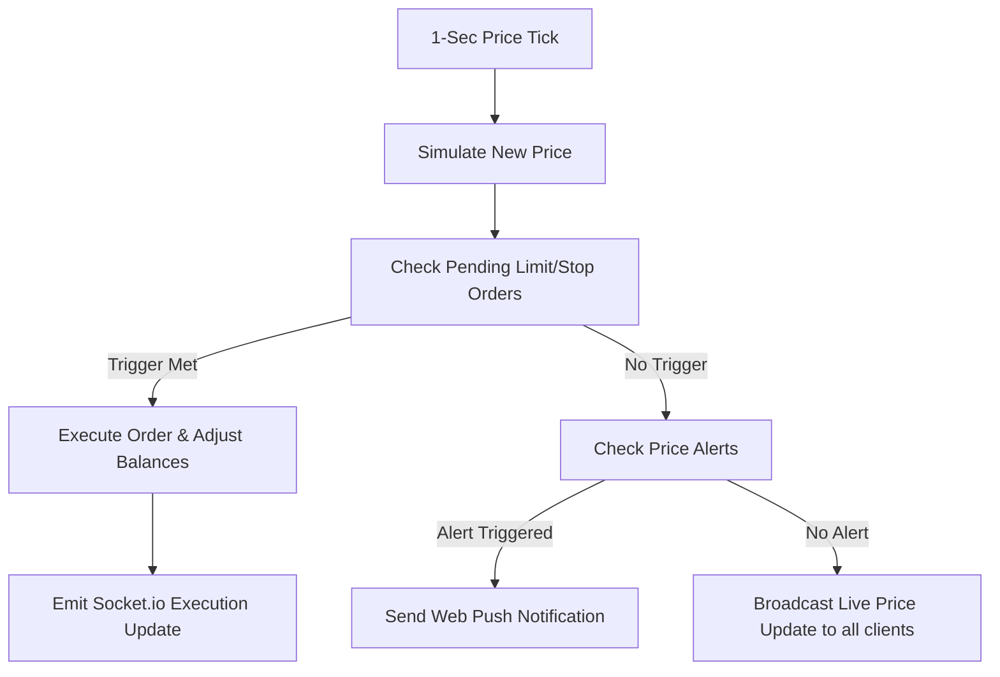

# 📈 BullCash: Full-Stack Stock Market Simulator

BullCash is a premium, feature-rich, full-stack stock market simulator designed to provide a realistic virtual trading experience. It features real-time simulated price feeds, advanced order types (Market, Limit, Stop), desktop push notifications, a social community hub for sentiment sharing, comprehensive portfolio performance analytics, and integrated sandbox payments.

---

## 🚀 Key Features

*   **Real-Time Price Simulation & Live Feeds**: A proprietary backend simulation engine recalculates asset prices every second using a random walk algorithm. Real-time ticks are pushed to clients instantly using WebSockets via **Socket.io**.
*   **Diverse Financial Instruments**: Simulates over 150 assets seeded directly with 365 days of historical data from Yahoo Finance:
    *   **NSE Equities** (e.g., RELIANCE, TCS, INFY, HDFCBANK)
    *   **Midcaps & Sectoral Leaders** (e.g., ZOMATO, PAYTM, NYKAA)
    *   **Exchange-Traded Funds (ETFs)** (e.g., NIFTYBEES, GOLDBEES)
    *   **Forex Currency Pairs** (e.g., USD/INR, EUR/INR)
    *   **Cryptocurrencies** (e.g., BTC/INR, ETH/INR)
    *   **Major Market Indices** (e.g., NIFTY 50, SENSEX, NIFTY BANK)
*   **Advanced Order Execution**:
    *   **Market Orders**: Executes immediately at current market price.
    *   **Limit Orders**: Executed automatically when the asset price falls below a target (for BUYs) or rises above a target (for SELLs).
    *   **Stop Orders**: Triggered as safety nets or momentum entries when threshold levels are crossed.
*   **Desktop Price Alerts & Push Notifications**: Set custom "Price Above" or "Price Below" targets. The server tracks price changes and triggers browser-native Web Push notifications (via Service Workers) even if the app is minimized.
*   **Technical Indicator Charts**: High-fidelity candle charts built on TradingView’s `lightweight-charts`, integrated with togglable technical overlays:
    *   Simple Moving Average (SMA)
    *   Exponential Moving Average (EMA)
    *   Relative Strength Index (RSI)
    *   Moving Average Convergence Divergence (MACD)
*   **Social Idea Sharing & Community Hub**: A built-in financial forum where users publish trading posts ("Ideas"), attach specific tickers, comment, and upvote discussions to gauge overall crowd sentiment.
*   **Virtual Wallet & Payment Integrations**: Sandbox payment gateways via **Razorpay** and **Stripe** to add virtual funds. Includes an audited transaction ledger tracking fees, trades, and deposits.
*   **PnL Calendar Heatmap**: Visual monthly calendar detailing daily realized profit and loss (Realized P&L) to track consistency and trading performance.

---

## 🛠️ Tech Stack

### Frontend
*   **Framework**: React (Vite-powered SPA, ES Modules)
*   **State Management**: Redux Toolkit & React-Redux (handling auth, prices, and settings)
*   **Styling & UI**: Tailwind CSS (sleek dark mode design), Framer Motion (micro-animations), React Icons, React Hot Toast
*   **Visualization**: Recharts (portfolio allocations) & TradingView Lightweight Charts (technical analytics)
*   **Websockets & Push**: Socket.io Client & Service Worker Push API

### Backend
*   **Runtime**: Node.js & Express
*   **Database**: MongoDB & Mongoose ORM
*   **Websockets**: Socket.io (managing active rooms for asset price subscriptions)
*   **Notifications**: Web-Push (VAPID key signatures)
*   **External APIs**: Yahoo Finance 2 (for downloading daily historical charts)

---

## 📁 Project Architecture

```
Stock_Market_Simulator/
├── backend/
│   ├── config/            # Mongoose DB connector
│   ├── controllers/       # Route handlers (auth, orders, wallet, social, alerts, etc.)
│   ├── middleware/        # JWT auth, express rate-limiters, error handling
│   ├── models/            # Mongoose schemas (User, Stock, Order, Transaction, Alert, Idea)
│   ├── routes/            # REST API endpoints
│   ├── scripts/           # User seeding scripts
│   ├── seeds/             # 150+ asset seeder utilizing Yahoo Finance
│   ├── services/          # Business logic engines (Price Engine, Trading Engine)
│   ├── sockets/           # WebSocket socket.io managers (price feeds, execution updates)
│   ├── utils/             # Web Push notifier, validators, math indicators
│   └── server.js          # Node Express server startup file
│
├── frontend/
│   ├── public/            # Static files and Service Worker scripts
│   ├── src/
│   │   ├── components/    # Reusable UI (charts, dashboard panels, order forms)
│   │   ├── context/       # React Contexts
│   │   ├── hooks/         # Custom hooks (e.g. useSocket)
│   │   ├── pages/         # Dashboard, Trade page, PnL Calendar, Screener, Social Community
│   │   ├── store/         # Redux slices (auth, UI settings)
│   │   ├── utils/         # Service worker registrants, formatter functions
│   │   ├── App.jsx        # Route definitions
│   │   └── main.jsx       # Entry point
│   ├── vercel.json        # Routing overrides for SPA deployment
│   ├── tailwind.config.js # CSS theme variables
│   └── vite.config.js     # Dev server proxies
│
├── DEPLOYMENT.md          # Cloud hosting instructions
├── render.yaml            # Render blueprint definition
└── package.json           # Concurrently package runner
```

---

## 🧠 Core System Design & Logic

### 1. Price Simulation Engine (`backend/services/priceEngine.js`)
At the core of BullCash is a simulated market clock. The backend maintains a loop that triggers every **1 second**:
*   **Random Walk Algorithm**: For each active stock, the engine updates the price by:
    $$\Delta P_t = P_{t-1} \times \text{Random}(-3\%, +3\%)$$
*   **OHLCV Generation**: Live prices update the latest 1-second candle. Volume is generated realistically ($100k - 5M$ units). Candles are stored in a rolling buffer (capped at the last 500) to keep memory footprint bounded.
*   **Yahoo Finance Seeding**: On the initial run, the system requests 365 days of actual daily candles for all symbols. If Yahoo Finance returns a rate-limit error, the engine generates simulated historical candles to ensure zero setup hurdles.

### 2. Trade Execution Engine (`backend/services/tradingEngine.js`)
*   **Funds Locking**: When placing a Limit or Stop BUY order, funds are instantly locked from the user's virtual balance. This prevents users from spending locked margins.
*   **Shares Locking**: When placing a Limit or Stop SELL order, the shares are instantly deducted from the portfolio. If the order is cancelled, shares are returned.
*   **Limit/Stop Monitoring**: During the 1-second price ticks, the engine loops through pending orders:
    *   *Limit BUY*: Triggers when `CurrentPrice <= LimitPrice` (executes at `CurrentPrice` and refunds any surplus margin difference to the wallet).
    *   *Limit SELL*: Triggers when `CurrentPrice >= LimitPrice`.
    *   *Stop BUY*: Triggers when `CurrentPrice >= StopPrice`.
    *   *Stop SELL*: Triggers when `CurrentPrice <= StopPrice`.
*   **Realized P&L & Cost Basis**: Sell orders calculate realized profit/loss against the average purchase price (cost-basis) of those shares:
    $$\text{Realized P\&L} = (\text{Execution Price} - \text{Average Cost}) \times \text{Quantity}$$



### 3. Sockets & Subscriptions (`backend/sockets/`)
*   **`priceSocket.js`**: Clients joining the trading screen subscribe to specific rooms (e.g., `RELIANCE`). Socket.io streams live ticks only for symbols the user has active. A global feed publishes aggregate ticker data for the main dashboard list.
*   **`tradeSocket.js`**: Users join a personal room named `user_<userId>` upon logging in. When a pending order gets triggered by the backend, the execution details are broadcast directly to the specific user's socket, updating their balance and positions instantly without reloading.

### 4. Alert & Web Push Subscriptions (`backend/utils/pushNotifier.js`)
*   Uses the VAPID protocol to register browser push endpoints.
*   If VAPID keys are missing from the environment, the server **automatically generates temporary keys** on startup, enabling push notifications locally without requiring manual credential generation.
*   Subscriptions are stored in MongoDB. When a price alert triggers, a web push message is dispatched. Expired subscriptions (HTTP 404/410) are auto-pruned.

---

## ⚙️ Environment Variables

Copy `.env.example` in the root folder to `.env`:

```bash
# MongoDB Connection String
MONGO_URI=mongodb://127.0.0.1:27017/stock_simulator

# JWT Secret for Session Auths
JWT_SECRET=your_secret_here

# Payment Settings (Test/Sandbox Keys)
RAZORPAY_KEY_ID=rzp_test_XXXXXXXXXXXXXXX
RAZORPAY_KEY_SECRET=XXXXXXXXXXXXXXXXXXXXXXXX
RAZORPAY_WEBHOOK_SECRET=your_webhook_secret_here

# Historical Stock Data Seeding (Optional)
ALPHA_VANTAGE_API_KEY=demo

# Server Configurations
PORT=5000
NODE_ENV=development

# CORS Whitelist Settings
CLIENT_URL=http://localhost:5173
```

In the `frontend` folder, create `.env` using `.env.example`:
```env
# URL where backend is hosted
VITE_API_URL=http://localhost:5000

# Google OAuth 2.0 client credentials (for Google Sign In)
VITE_GOOGLE_CLIENT_ID=your_google_oauth_client_id
```

---

## 💻 Local Development Setup

### Prerequisite
*   Node.js (v16+)
*   MongoDB running locally or a MongoDB Atlas URI

### Step-by-Step Installation

1.  **Clone & Install Dependencies**:
    Initialize and install root package along with frontend and backend libraries:
    ```bash
    npm run install-all
    ```

2.  **Seed Stocks Database**:
    Seed the MongoDB database with the 150+ Yahoo-Finance stocks and 365 days of historical daily charts:
    ```bash
    npm run seed
    ```

3.  **Seed Mock Users (Optional)**:
    Seed dummy user profiles with pre-allocated portfolios and virtual funds for quick testing:
    ```bash
    npm run seed:users
    ```

4.  **Run Dev Environment**:
    Start the backend server and frontend Vite server concurrently:
    ```bash
    npm start
    ```
    *   **Frontend**: `http://localhost:5173`
    *   **Backend API**: `http://localhost:5000`

---

## 🔑 Demo Access Profiles

Use the seeded profiles below to test pre-loaded portfolios:

| Email | Password | Initial Balance | Initial Portfolio Holdings |
| :--- | :--- | :--- | :--- |
| `demo@example.com` | `password123` | ₹15,000 | RELIANCE, TCS |
| `trader@example.com` | `password123` | ₹50,000 | INFY, SBIN, HDFCBANK |

---

## 🌐 Production Deployments

For full visual steps and configuration checklists, read [DEPLOYMENT.md](file:///c:/Users/preri/OneDrive/Desktop/Stock_Market_Simulator/DEPLOYMENT.md).

*   **Backend Hosting**: Recommended on **Render.com** as a Web Service. Set root directory to `backend`, build command to `npm install`, start command to `npm start`, and configure the backend environment variables.
*   **Frontend Hosting**: Recommended on **Vercel**. Set root directory to `frontend`, preset to `Vite`, build command to `npm run build`, output directory to `dist`, and configure the Vite environment variables. The custom `vercel.json` ensures that all routing redirects fallback to `index.html` for smooth client-side React SPA navigation.

---

## 📄 License
This project is licensed under the ISC License.
